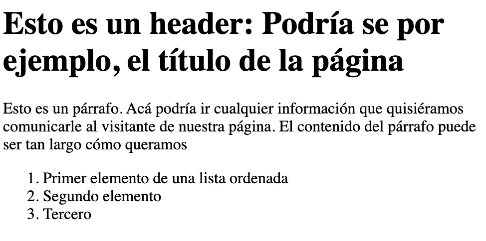

# Introducción a HTML & HTML5

HTML significa **H**yper**T**ext **M**arkup **L**anguage, es un lenguaje de marcado que describe la estructura del contenido de una página web.

Usa una sintáxis especial o podríamos llamarla también notación, para darle información a los navegadores web, acerca de la página y la información que está contiene, es decir, es hablar con los navegadores web y decirles por medio de un lenguaje de marcas que estos conocen, cómo queremos que esa información se vea.

Los elementos que se pueden usar en html se describen por medio de etiquetas (en inglés tags) que rodean el contenido.

Por ejemplo, hay diferentes etiquetas que pueden ponerse alrededor de un texto para decirle al navegador que ese contenido es un encabezado 
```html 
<h1>texto encabezado</h1>
```

un párrafo
```html 
<p>esto es un párrafo</p>
```

o una lista
```html 
<ul>
  <li>primer elemento de la lista</li>
  <li>segundo</li>
  <li>tercero</li>
</ul>
```

## Ahora veamos esto en acción: 
 1) creemos un archivo dentro de esta carpeta y nombremoslo ejemplo1.html
 2) copiemos el siguiente código dentro de ese archivo

```html
<h1>Esto es un header: Podría ser por ejemplo, el título de la página</h1>

<p>Esto es un párrafo. Acá podría ir cualquier información que quisiéramos comunicarle al visitante de nuestra página. El contenido del párrafo puede ser tan largo cómo queramos
</p>

<ol>
  <li>Primer elemento de una lista ordenada</li>
  <li>Segundo elemento</li>
  <li>Tercero</li>
</ol>
```

El resultado debería ser el siguiente:



